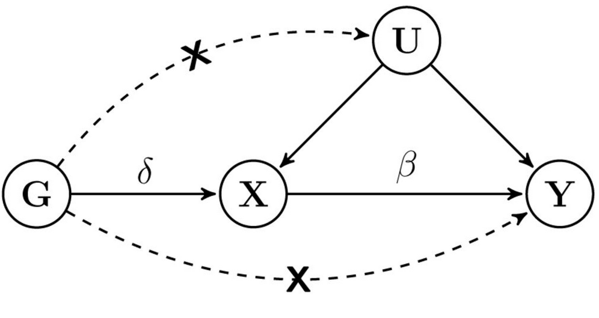

```{r, include = FALSE}
knitr::opts_chunk$set(
  collapse = TRUE,
  comment = "#>"
)
```

```{r setup}
library(simulateGP)
```

The Mendelian randomisation statistical method aims to estimate the causal effect of some exposure $x$ on some outcome $y$ using a genetic instrumental variable for the exposure, $g$. The assumptions of the model are that

1. $g$ associates with $x$
2. $g$ is independent of any confounders of $x$ and $y$
3. $g$ only associates with $y$ via $x$

A DAG representing the assumptions is below:



We can simulate individual level data according to this DAG

1. Simulate some genetic or confounding variables
2. Simulate exposures that are influenced by (1)
3. Simulate the outcomes that are influenced by (1) and (2)
4. Obtain MR estimate using two-stage least squares

Here is how to do 1-3:

```{r}
# Set causal effect of x on y
beta_xy <- -0.3

# Set number of instruments for x
nsnp <- 3

# Set number of individuals to simulate
nid <- 10000

# Set variance explained in x by the instruments
rsq_gx <- 0.05

# Generate a confounder
u <- rnorm(nid)

# Generate genotypes with allele frequencies of 0.5
g <- make_geno(nid=nid, nsnp=nsnp, af=0.5)

# These SNPs instrument some exposure, and together explain 5% of the variance
effs <- choose_effects(nsnp=nsnp, totvar=rsq_gx)

# Create X - influenced by snps and the confounder
x <- make_phen(effs=c(effs, 0.3), indep=cbind(g, u))
```

Check that the SNPs explain 5% of the variance in x

```{r}
sum(cor(x, g)^2)
```

Create Y, which is negatively influenced by x and positively influenced by the confounder

```{r}
y <- make_phen(effs=c(beta_xy, 0.3), cbind(x, u))
```

We now have an X and Y, and the genotypes. To perform 2-stage least squares MR on this we can use the `systemfit` package.

```{r}
library(systemfit)
summary(systemfit(y ~ x, method="2SLS", inst = ~ g))
```

Compare against confounded observational estimate

```{r}
summary(lm(y ~ x))
```

