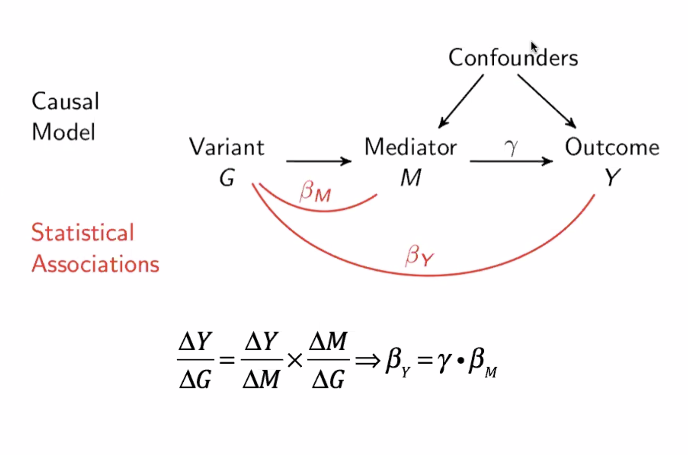

```{r, include = FALSE}
knitr::opts_chunk$set(
  collapse = TRUE,
  comment = "#>"
)
```

```{r setup}
library(simulateGP)
library(TwoSampleMR)
```

A convenient approach to performing Mendelian randomisation is to use GWAS summary data, often known as summary MR or 2-sample MR. This figure outlines the approach:



In this vignette we simulate some examples of how to simulate the underlying GWAS summary data for 2-sample MR.

## Generating summary data from individual level data

Here we want to achieve the following:

1. Simulate some genetic or confounding variables
2. Simulate exposures that are influenced by (1)
3. Simulate the outcomes that are influenced by (1) and (2)
4. Get the SNP-exposure and SNP-outcome effects and standard errors for these simulations, for use in further analyses e.g. using the [TwoSampleMR](https://github.com/MRCIEU/TwoSampleMR) package

Here is how to do 1-3:

```{r}
# Genotypes for 20 SNPs and 10000 individuals, where the SNPs have MAF = 0.5:
g <- make_geno(10000, 20, 0.5)

# These SNPs instrument some exposure, and together explain 5% of the variance
effs <- choose_effects(20, 0.05)

# Create X
x <- make_phen(effs, g)

# Check that the SNPs explain 5% of the variance in x
sum(cor(x, g)^2)

# Create Y, which is negatively influenced by x, explaining 10% of the variance in Y#
# so if the variances of x and y are both 1 then the effect size is about -0.31
beta_xy <- -sqrt(0.1)
y <- make_phen(beta_xy, x)
```


We now have an X and Y, and the genotypes. To perform 2-sample MR on this we need to obtain the summary data.

```{r}
dat <- get_effs(x, y, g)
```

Perform MR

```{r}
TwoSampleMR::mr(dat)
```

The effect size is approx -0.31 as we simulated.

### More complex example

Let's simulate an instance where there are two traits that have different effects on the outcome, but they share some of the same instruments

```{r}
# Simulate 100 genotypes
g <- make_geno(100000, 80, 0.5)

# Choose effect sizes for instruments for each trait
effs1 <- choose_effects(50, 0.05)
effs2 <- choose_effects(50, 0.05)

# Create X1 and X2, where they overlap some variants
x1 <- make_phen(effs1, g[,1:50])
x2 <- make_phen(effs2, g[,31:80])

# Create Y - x1 has a -0.3 influence on it and x2 has a +0.3 influence on it
y <- make_phen(c(-0.3, 0.3), cbind(x1, x2))

# Perform separate MR on each
dat1 <- get_effs(x1, y, g)
dat2 <- get_effs(x2, y, g)

TwoSampleMR::mr(subset(dat1, pval.exposure < 5e-8))
TwoSampleMR::mr(subset(dat2, pval.exposure < 5e-8))

# Do multivariable MR
# First get the effects for x1, x2 and y, and put them in mv format
mvdat <- make_mvdat(list(x1, x2), y, g)

# Perform MV MR
TwoSampleMR::mv_multiple(mvdat)
```

## Generating summary data directly

For large scale analyses it is more convenient to just generate the summary data directly. For this we need to specify the genotype effects on $x$, determine the standard errors expected based on the sample size, and then determine the genotype effect on $y$ according to causal effects of $x$ and pleiotropic paths, and determine the sample sizes for $y$ also. We can additionally specify the extent of sample overlap.


### No sample overlap case

1. Choose true effects of instruments on $x$
2. Generate summary data for $x$
3. Determine effects of instruments on $y$
4. Generate summary data for $y$
5. Perform two-sample MR

Choose some number of SNPs and the effect allele frequencies and the variance explained in $x$ by the SNPs

```{r}
nsnp <- 100
af <- runif(100)
rsq_gx <- 0.4
```

Generate some effects that correspond to these values

```{r}
b_gx <- generate_gwas_params(af=af, h2=rsq_gx)

```

Generate sample effects for 1 million samples

```{r}
nid_x <- 1000000
bhat_gx <- generate_gwas_ss(beta=b_gx$beta, af=b_gx$af, nid=nid_x)
```

Assume $x$ has an effect on $y$ of -0.3

```{r}
b_xy <- -0.3
```

Simulate some balanced pleiotropy - assume that 50% of the instruments have a direct effect on $y$ and they explain 2% of the variance through this path

```{r}
plei_index <- sample(1:nsnp, nsnp*0.5)
b_gy_plei <- generate_gwas_params(af=af[plei_index], h2=0.02)
```

Sum the genetic effects on $y$

```{r}
b_gy <- b_gx
b_gy$beta <- b_gy$beta * b_xy
b_gy$beta[plei_index] <- b_gy$beta[plei_index] + b_gy_plei$beta
```

Generate summary data for g-y associations, assuming sample size of 800000

```{r}
nid_y <- 800000
bhat_gy <- generate_gwas_ss(beta=b_gy$beta, af=b_gy$af, nid=nid_y)
```

Perform MR

```{r}
dat <- merge_exp_out(bhat_gx, bhat_gy)
```

```{r}
TwoSampleMR::mr(dat)
```

### Sample overlap case

It is of course possible to simulate varying degrees of sample overlap by simulating two individual-level datasets with the same underlying DAG, and then selecting which individuals contribute to the exposure and outcome effects e.g.

```{r}
nid <- 10000
nsnp <- 100
g <- make_geno(nid, nsnp, 0.5)
u <- rnorm(nid)
beta_gx <- choose_effects(nsnp, 0.05)
x <- make_phen(c(beta_gx, 0.1), cbind(g, u))
y <- make_phen(c(0.3, 0.1), cbind(x, u))
```

Complete sample overlap

```{r}
dat <- get_effs(x, y, g)
```

No sample overlap

```{r}
id1 <- 1:(nid/2)
id2 <- (nid/2+1):nid
exp <- gwas(x[id1], g[id1,])
out <- gwas(y[id2], g[id2,])
dat <- merge_exp_out(exp, out)
```

Partial sample overlap

```{r}
id1 <- 1:round(nid/1.5)
id2 <- round(nid/1.5+1):nid
exp <- gwas(x[id1], g[id1,])
out <- gwas(y[id2], g[id2,])
dat <- merge_exp_out(exp, out)
```

---

An approach to doing this directly, bypassing simulation of individuals, is also implemented in the `summary_set` function e.g.

```{r}
nsnp <- 100
af <- runif(nsnp, 0.01, 0.99)
beta_gx <- generate_gwas_params(af, h2=0.5)
beta_gy <- beta_gx
beta_gy$beta <- beta_gy$beta * 0.3

dat <- summary_set(
	beta_gx = beta_gx$beta,
	beta_gy = beta_gy$beta,
	af = af,
	n_gx = 10000,
	n_gy = 10000,
	n_overlap = 10000,
	cor_xy = 0.6,
	prev_y = NA,
	sigma_x = 1,
	sigma_y = 1
)

dat %>%
	dplyr::filter(pval.exposure < 5e-8) %>%
	TwoSampleMR::mr(., method_list="mr_ivw")
```

